# Análise de Variância (ANOVA)

Essa análise é  realizada a partir de testes estatísticos de datasets para verificar se existe uma diferença significativa entre as diferenças amostrais observadas. 
Assim, essa analise visa explicar se as diferenças observadas são significativas ou reais, ou não são significativas, ou seja, são casuais, decorrentes da mera variabilidade amostral.

Portanto, essa análise parte do pressuposto que o acaso só produz pequenos desvios, sendo as grandes diferenças geradas por causas reais. 

Para determinar se existe diferença entre as médias, utiliza-se o teste de hipótese, no qual temos duas possibilidades: 

(1) Hipótese nula (H0), ou seja as médias populacionais são iguais, 
(2) Hipótese alternativa (HA), as médias populacionais são diferentes, ou pelo menos uma das médias é diferente das demais. 

Além disso, existem dois tipos de análises por ANOVA: 

(a) One-Way ANOVA; e 

(b) Two-Way ANOVA. Nesse tutorial iremos abordar a análise por One-Way ANOVA.

Neste estudo será utilizado o teste A One-Way ANOVA, pois será testadas as diferenças entre mais de três grupos.

# Objetivo do estudo 

Verificar se as diferenças entre os conjuntos de dados são significativas, ou seja HA é verdadeira, ou não significativa, ou seja H0 é verdadeira.


# Materiais e técnicas

Será utilizado o software R, versão 3.6.2 (12-12-2019),
Copyright (C) 2019, feito pela Fundação R para Computação Estatística, em Plataforma: x86_64-w64-mingw32 / x64 (64 bits).

R é um software livre criado em um projeto colaborativo, distribuído sob os termos do GNU General Public License, Versão 2, junho de 1991 ou Versão 3, junho de 2007.

Cópias das versões 2 e 3 da licença podem ser encontradas
em https://www.R-project.org/Licenses/.

A linguagem R apresenta diversas funções e pacotes específicos para análises estatísticas e para criação de gráficos.


## Pacotes R utilizados


```r
# Pacotes e Funções
library(tidyverse) 
library(igraph)
library(ggraph)
library(ggplot2)
library(dplyr)
library(knitr)
library(pdftools)
```

## Variáveis

P1	- POSITIVO	FALA	fala do candidato sincronizada com imagem

P2	- POSITIVO	QUADRO	Close-up (cabeça inteira e parte do peito - intimidade)

P3	- POSITIVO	ÂNGULO 	De baixo (empodera o candidato - como o olhar da criança que mira o adulto)

P4	- POSITIVO	MOV. LENTE	zoom-in (aproximação, aprofundam.)

P5	- POSITIVO	MOV. LENTE	camera no ombro (acompanha o candidato, estamos juntos, no mesmo nível)

No6	- NEGATIVO	FALA 	imagem do candidato falando  sem ouvirmos, por baixo de narração  de reporter (lip flap)

No7	-  NEGATIVO	QUADRO	Extreme close-up (corta cabeça ou queixo -muito detalhe)

No8	- NEGATIVO	QUADRO	long shot (aberto, candidato a distância - distração com elementos ao redor)

No9	- NEGATIVO	ÂNGULO 	De cima (diminui o candidato)

No10 - NEGATIVO	MOV. LENTE	zoom-out (distanciamento)

N11 - NEUTRO	FALA	imagem candidato sem fala embaixo de off reporter 12 - NEUTRO	FALA	imagens de outras pessoas com audio, sem candidato

N13 - NEUTRO	FALA	off de reporter, sem imagem do candidato

N14 - NEUTRO	FALA	cabeça de apresentador, sem imagem do candidato

N15 - NEUTRO	FALA	passagem de repórter falando para cam, sem imagem do candidato

N16 - NEUTRO	QUADRO	medium-shot (até cintura, pode aparecer gente ao lado)

N17 - NEUTRO	MOV. LENTE	Nível do olho (conversa de pessoa para pessoa)

## Dados


```r
library(readr)
setwd("~/ANOVA")
Visual_Bias <- read_delim("VB.csv", ";", escape_double = FALSE, trim_ws = TRUE)
```

```
## Parsed with column specification:
## cols(
##   Candidatos = col_character(),
##   P1 = col_double(),
##   P2 = col_double(),
##   P3 = col_double(),
##   P4 = col_double(),
##   P5 = col_double(),
##   No6 = col_double(),
##   No7 = col_double(),
##   No8 = col_double(),
##   No9 = col_double(),
##   No10 = col_double(),
##   N11 = col_double(),
##   N12 = col_double(),
##   N13 = col_double(),
##   N14 = col_double(),
##   N15 = col_double(),
##   N16 = col_double(),
##   N17 = col_double()
## )
```

```r
DT::datatable(Visual_Bias)
```

<!--html_preserve--><div id="htmlwidget-6342ff59d1ada3178516" style="width:100%;height:auto;" class="datatables html-widget"></div>
<script type="application/json" data-for="htmlwidget-6342ff59d1ada3178516">{"x":{"filter":"none","data":[["1","2","3","4","5","6","7"],["ALCKMIN","BOLSONARO","COB. ATENTADO","CIRO","MARINA","HADDAD","COB. ATENTADO"],[864,446,0,904,852,511,0],[956,383,6,1067,945,565,6],[131,254,39,412,81,235,39],[11,39,5,42,42,59,5],[139,74,0,167,96,32,0],[327,152,187,605,474,248,187],[53,76,0,66,62,4,0],[183,100,119,196,190,123,119],[343,70,115,211,338,150,115],[40,23,0,41,41,9,0],[819,555,193,447,542,307,193],[0,0,2623,0,0,0,2623],[45,1272,758,326,85,61,758],[183,471,650,258,187,162,650],[401,495,320,455,452,273,320],[736,266,52,529,602,323,52],[1411,454,8,1152,1302,628,8]],"container":"<table class=\"display\">\n  <thead>\n    <tr>\n      <th> <\/th>\n      <th>Candidatos<\/th>\n      <th>P1<\/th>\n      <th>P2<\/th>\n      <th>P3<\/th>\n      <th>P4<\/th>\n      <th>P5<\/th>\n      <th>No6<\/th>\n      <th>No7<\/th>\n      <th>No8<\/th>\n      <th>No9<\/th>\n      <th>No10<\/th>\n      <th>N11<\/th>\n      <th>N12<\/th>\n      <th>N13<\/th>\n      <th>N14<\/th>\n      <th>N15<\/th>\n      <th>N16<\/th>\n      <th>N17<\/th>\n    <\/tr>\n  <\/thead>\n<\/table>","options":{"columnDefs":[{"className":"dt-right","targets":[2,3,4,5,6,7,8,9,10,11,12,13,14,15,16,17,18]},{"orderable":false,"targets":0}],"order":[],"autoWidth":false,"orderClasses":false}},"evals":[],"jsHooks":[]}</script><!--/html_preserve-->


# Método do Estudo

**Pressupostos do método** 

1. Todas as observações devem ser independentes;

2. As observações em cada grupo devem possuir uma distribuição, aproximadamente normal;

3. As variâncias em cada grupo devem ser aproximadamente iguais;
A variável dependente é contínua.

## Etapa 1 - Organização e preparação dos dados

Organização da variável categórica (Candidatos) dependente e independentes (demais variáveis) para aplicação dos testes;


```r
setwd("~/ANOVA")
library(readxl)
Tidy1 <- read_excel("Tidy1.xlsx")

DT::datatable(Tidy1)
```

<!--html_preserve--><div id="htmlwidget-9d92dc1885f99aabff49" style="width:100%;height:auto;" class="datatables html-widget"></div>
<script type="application/json" data-for="htmlwidget-9d92dc1885f99aabff49">{"x":{"filter":"none","data":[["1","2","3","4","5","6","7","8","9","10","11","12","13","14","15","16","17","18","19","20","21","22","23","24","25","26","27","28","29","30","31","32","33","34","35","36","37","38","39","40","41","42","43","44","45","46","47","48","49","50","51","52","53","54","55","56","57","58","59","60","61","62","63","64","65","66","67","68","69","70","71","72","73","74","75","76","77","78","79","80","81","82","83","84","85"],["ALCKMIN","ALCKMIN","ALCKMIN","ALCKMIN","ALCKMIN","ALCKMIN","ALCKMIN","ALCKMIN","ALCKMIN","ALCKMIN","ALCKMIN","ALCKMIN","ALCKMIN","ALCKMIN","ALCKMIN","ALCKMIN","ALCKMIN","BOLSONARO","BOLSONARO","BOLSONARO","BOLSONARO","BOLSONARO","BOLSONARO","BOLSONARO","BOLSONARO","BOLSONARO","BOLSONARO","BOLSONARO","BOLSONARO","BOLSONARO","BOLSONARO","BOLSONARO","BOLSONARO","BOLSONARO","CIRO","CIRO","CIRO","CIRO","CIRO","CIRO","CIRO","CIRO","CIRO","CIRO","CIRO","CIRO","CIRO","CIRO","CIRO","CIRO","CIRO","MARINA","MARINA","MARINA","MARINA","MARINA","MARINA","MARINA","MARINA","MARINA","MARINA","MARINA","MARINA","MARINA","MARINA","MARINA","MARINA","MARINA","HADDAD","HADDAD","HADDAD","HADDAD","HADDAD","HADDAD","HADDAD","HADDAD","HADDAD","HADDAD","HADDAD","HADDAD","HADDAD","HADDAD","HADDAD","HADDAD","HADDAD"],[864,956,131,11,139,327,53,183,343,40,819,0,45,183,401,736,1411,446,389,293,44,74,339,76,219,185,23,748,2623,2030,1121,815,318,462,904,1067,412,42,167,605,66,196,211,41,447,0,326,258,455,529,1152,852,945,81,42,96,474,62,190,338,41,542,0,85,187,452,602,1302,511,565,235,59,32,248,4,123,150,9,307,0,61,162,273,323,628]],"container":"<table class=\"display\">\n  <thead>\n    <tr>\n      <th> <\/th>\n      <th>Candidato<\/th>\n      <th>VB<\/th>\n    <\/tr>\n  <\/thead>\n<\/table>","options":{"columnDefs":[{"className":"dt-right","targets":2},{"orderable":false,"targets":0}],"order":[],"autoWidth":false,"orderClasses":false}},"evals":[],"jsHooks":[]}</script><!--/html_preserve-->

```r
Tidy2 <- read_excel("Tidy2.xlsx")

TidyP <- read_excel("TidyP.xlsx")

TidyNo <- read_excel("TidyNo.xlsx")

TidyN <- read_excel("TidyN.xlsx")
```


## Etapa 2 - Análise de Variância simples

### Variâncias dos candidatos (X) e respectivas variáveis (Y)

Visualizar as variâncias dos dados dos candidadtos é uma forma simples para verificar se o tratamento das imagens distoam muito entre os candidatos. 


```r
.Agreg <- function(d) {
  
  DT::datatable(aggregate(VB ~ Candidato, d, var))
  
}
# Analise com facada agrupado ao Bolsonaro
.Agreg(Tidy1)
```

<!--html_preserve--><div id="htmlwidget-18c5df2ef647ae2ed767" style="width:100%;height:auto;" class="datatables html-widget"></div>
<script type="application/json" data-for="htmlwidget-18c5df2ef647ae2ed767">{"x":{"filter":"none","data":[["1","2","3","4","5"],["ALCKMIN","BOLSONARO","CIRO","HADDAD","MARINA"],[172758.470588235,519804.720588235,125872.632352941,39738.4338235294,142927.808823529]],"container":"<table class=\"display\">\n  <thead>\n    <tr>\n      <th> <\/th>\n      <th>Candidato<\/th>\n      <th>VB<\/th>\n    <\/tr>\n  <\/thead>\n<\/table>","options":{"columnDefs":[{"className":"dt-right","targets":2},{"orderable":false,"targets":0}],"order":[],"autoWidth":false,"orderClasses":false}},"evals":[],"jsHooks":[]}</script><!--/html_preserve-->

```r
# Analise com facada separada
.Agreg(Tidy2)
```

<!--html_preserve--><div id="htmlwidget-70929fe473e4350162cb" style="width:100%;height:auto;" class="datatables html-widget"></div>
<script type="application/json" data-for="htmlwidget-70929fe473e4350162cb">{"x":{"filter":"none","data":[["1","2","3","4","5","6"],["ALCKMIN","BOLSONARO","CIRO","COB. ATENTADO","HADDAD","MARINA"],[172758.470588235,98945.0661764706,125872.632352941,410531.889705882,39738.4338235294,142927.808823529]],"container":"<table class=\"display\">\n  <thead>\n    <tr>\n      <th> <\/th>\n      <th>Candidato<\/th>\n      <th>VB<\/th>\n    <\/tr>\n  <\/thead>\n<\/table>","options":{"columnDefs":[{"className":"dt-right","targets":2},{"orderable":false,"targets":0}],"order":[],"autoWidth":false,"orderClasses":false}},"evals":[],"jsHooks":[]}</script><!--/html_preserve-->

```r
# Analise VB Positivo
.Agreg(TidyP)
```

<!--html_preserve--><div id="htmlwidget-f8e9f38ca504d5291653" style="width:100%;height:auto;" class="datatables html-widget"></div>
<script type="application/json" data-for="htmlwidget-f8e9f38ca504d5291653">{"x":{"filter":"none","data":[["1","2","3","4","5"],["ALCKMIN","BOLSONARO","CIRO","HADDAD","MARINA"],[172758.470588235,519804.720588235,125872.632352941,39738.4338235294,142927.808823529]],"container":"<table class=\"display\">\n  <thead>\n    <tr>\n      <th> <\/th>\n      <th>Candidato<\/th>\n      <th>VB<\/th>\n    <\/tr>\n  <\/thead>\n<\/table>","options":{"columnDefs":[{"className":"dt-right","targets":2},{"orderable":false,"targets":0}],"order":[],"autoWidth":false,"orderClasses":false}},"evals":[],"jsHooks":[]}</script><!--/html_preserve-->

```r
# Analise VB Negativo
.Agreg(TidyNo)
```

<!--html_preserve--><div id="htmlwidget-dc5d0364e0721d52c76e" style="width:100%;height:auto;" class="datatables html-widget"></div>
<script type="application/json" data-for="htmlwidget-dc5d0364e0721d52c76e">{"x":{"filter":"none","data":[["1","2","3","4","5"],["ALCKMIN","BOLSONARO","CIRO","HADDAD","MARINA"],[20873.2,15404.8,51141.7,10549.7,34085]],"container":"<table class=\"display\">\n  <thead>\n    <tr>\n      <th> <\/th>\n      <th>Candidato<\/th>\n      <th>VB<\/th>\n    <\/tr>\n  <\/thead>\n<\/table>","options":{"columnDefs":[{"className":"dt-right","targets":2},{"orderable":false,"targets":0}],"order":[],"autoWidth":false,"orderClasses":false}},"evals":[],"jsHooks":[]}</script><!--/html_preserve-->

```r
# Analise VB Neutro
.Agreg(TidyN)
```

<!--html_preserve--><div id="htmlwidget-93894420cf71b47adee2" style="width:100%;height:auto;" class="datatables html-widget"></div>
<script type="application/json" data-for="htmlwidget-93894420cf71b47adee2">{"x":{"filter":"none","data":[["1","2","3","4","5"],["ALCKMIN","BOLSONARO","CIRO","HADDAD","MARINA"],[258900.619047619,730620.952380952,125629.619047619,42992.2857142857,193718.80952381]],"container":"<table class=\"display\">\n  <thead>\n    <tr>\n      <th> <\/th>\n      <th>Candidato<\/th>\n      <th>VB<\/th>\n    <\/tr>\n  <\/thead>\n<\/table>","options":{"columnDefs":[{"className":"dt-right","targets":2},{"orderable":false,"targets":0}],"order":[],"autoWidth":false,"orderClasses":false}},"evals":[],"jsHooks":[]}</script><!--/html_preserve-->

Neste estudo podemos verificar que há distorções bastante acentuadas no tratamento das imagens a depender dos candidatos.

### Teste de Bartlett para testar a homogeneidade das variâncias

Teste para verificar a homogeneidade das variâncias. O p-valor do teste apresenta o resultado de um teste de hipótese. 

Quando p-valor for menor que o nível de significância para o teste (convencionado em 0,05), rejeita-se a hipótese nula em favorecimento da hipótese alternativa. Isto significa que exite a desigualdade das variâncias. Caso ele seja maior que o nível de significância, conclui-se que as variâncias são constantes ou homogêneas.


```r
bartlett.test(VB ~ Candidato, Tidy1)
```

```
## 
## 	Bartlett test of homogeneity of variances
## 
## data:  VB by Candidato
## Bartlett's K-squared = 25.16, df = 4, p-value = 4.672e-05
```
 

Neste estudo o p-valor do teste de Bartlett foi maior que 0,05, demonstrando assim a homogeneidade das variâncias.

## Etapa 3 - Aplicando One-Way ANOVA

A One-Way ANOVA é utilizado quando a variável resposta é contínua (Y = observações de Visual Bias) e a variável explanatória é categórica (X = Candidatos). 

One-Way ANOVA é usado para testar diferenças entre pelo menos três grupos, uma vez que a comparação entre dois grupos pode ser obtida através do teste t.

O gráfico "Residual vs. Fitted" indíca a variância dos resíduos com relação aos valores ajustados, sendo ideal para analisar a presença de não-linearidades no modelo. 

O gráfico "Q-Q" dos resíduos padronizados, é usado para verificação da normalidade dos resíduos. 

O gráfico "Scale-Location" indica a distribuição de pontos no intervalo de valores previstos. A variação deve ser razoavelmente igual em todo o intervalo do preditor. 


### Análise ANOVA modelo Positivo, Negativo e Neutro agrupados


```r
.Anova <- function(z) {
  A <- lm(VB ~ Candidato -1, data = z)
  return(A)
}

# Análise AOV
AnovaAOV <- aov(Tidy1$VB ~ Tidy1$Candidato)
DT::datatable(anova(AnovaAOV))
```

<!--html_preserve--><div id="htmlwidget-a7af6c78094f991b6732" style="width:100%;height:auto;" class="datatables html-widget"></div>
<script type="application/json" data-for="htmlwidget-a7af6c78094f991b6732">{"x":{"filter":"none","data":[["Tidy1$Candidato","Residuals"],[4,80],[1266998.04705882,16017633.0588235],[316749.511764705,200220.413235294],[1.58200408562971,null],[0.187133422095542,null]],"container":"<table class=\"display\">\n  <thead>\n    <tr>\n      <th> <\/th>\n      <th>Df<\/th>\n      <th>Sum Sq<\/th>\n      <th>Mean Sq<\/th>\n      <th>F value<\/th>\n      <th>Pr(&gt;F)<\/th>\n    <\/tr>\n  <\/thead>\n<\/table>","options":{"columnDefs":[{"className":"dt-right","targets":[1,2,3,4,5]},{"orderable":false,"targets":0}],"order":[],"autoWidth":false,"orderClasses":false}},"evals":[],"jsHooks":[]}</script><!--/html_preserve-->

```r
summary(AnovaAOV)
```

```
##                 Df   Sum Sq Mean Sq F value Pr(>F)
## Tidy1$Candidato  4  1266998  316750   1.582  0.187
## Residuals       80 16017633  200220
```

```r
# Linear Model Anova
AnovaLM <- .Anova(Tidy1)
summary(AnovaLM)
```

```
## 
## Call:
## lm(formula = VB ~ Candidato - 1, data = z)
## 
## Residuals:
##    Min     1Q Median     3Q    Max 
## -577.3 -285.1 -146.6  147.7 2022.7 
## 
## Coefficients:
##                    Estimate Std. Error t value Pr(>|t|)    
## CandidatoALCKMIN      390.7      108.5   3.600 0.000550 ***
## CandidatoBOLSONARO    600.3      108.5   5.531 3.88e-07 ***
## CandidatoCIRO         404.6      108.5   3.728 0.000359 ***
## CandidatoHADDAD       217.1      108.5   2.000 0.048885 *  
## CandidatoMARINA       370.1      108.5   3.410 0.001021 ** 
## ---
## Signif. codes:  0 '***' 0.001 '**' 0.01 '*' 0.05 '.' 0.1 ' ' 1
## 
## Residual standard error: 447.5 on 80 degrees of freedom
## Multiple R-squared:  0.4774,	Adjusted R-squared:  0.4447 
## F-statistic: 14.62 on 5 and 80 DF,  p-value: 3.644e-10
```

```r
anova(AnovaLM)
```

```
## Analysis of Variance Table
## 
## Response: VB
##           Df   Sum Sq Mean Sq F value    Pr(>F)    
## Candidato  5 14632815 2926563  14.617 3.644e-10 ***
## Residuals 80 16017633  200220                      
## ---
## Signif. codes:  0 '***' 0.001 '**' 0.01 '*' 0.05 '.' 0.1 ' ' 1
```

```r
# Linear Model Anova Separados
VBSeparados <- .Anova(Tidy2)
summary(VBSeparados)
```

```
## 
## Call:
## lm(formula = VB ~ Candidato - 1, data = z)
## 
## Residuals:
##    Min     1Q Median     3Q    Max 
## -404.6 -262.0 -129.1  139.3 2324.5 
## 
## Coefficients:
##                        Estimate Std. Error t value Pr(>|t|)    
## CandidatoALCKMIN         390.71      98.56   3.964 0.000142 ***
## CandidatoBOLSONARO       301.76      98.56   3.062 0.002854 ** 
## CandidatoCIRO            404.59      98.56   4.105 8.49e-05 ***
## CandidatoCOB. ATENTADO   298.53      98.56   3.029 0.003152 ** 
## CandidatoHADDAD          217.06      98.56   2.202 0.030033 *  
## CandidatoMARINA          370.06      98.56   3.755 0.000297 ***
## ---
## Signif. codes:  0 '***' 0.001 '**' 0.01 '*' 0.05 '.' 0.1 ' ' 1
## 
## Residual standard error: 406.4 on 96 degrees of freedom
## Multiple R-squared:  0.4219,	Adjusted R-squared:  0.3858 
## F-statistic: 11.68 on 6 and 96 DF,  p-value: 8.678e-10
```

```r
anova(VBSeparados)
```

```
## Analysis of Variance Table
## 
## Response: VB
##           Df   Sum Sq Mean Sq F value    Pr(>F)    
## Candidato  6 11569903 1928317  11.678 8.678e-10 ***
## Residuals 96 15852389  165129                      
## ---
## Signif. codes:  0 '***' 0.001 '**' 0.01 '*' 0.05 '.' 0.1 ' ' 1
```

```r
plot(VBSeparados)
```

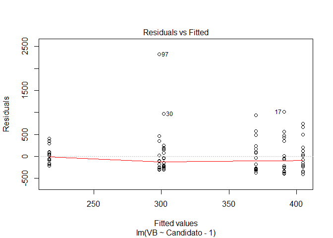<!-- -->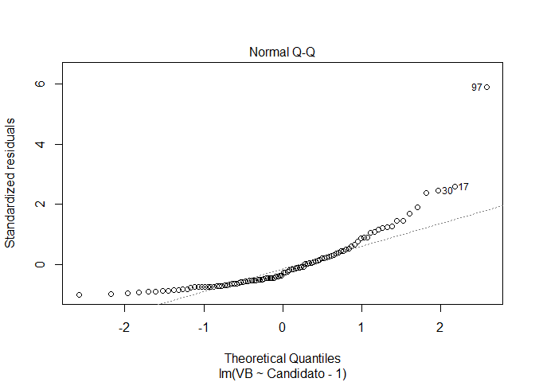<!-- -->

```
## hat values (leverages) are all = 0.05882353
##  and there are no factor predictors; no plot no. 5
```

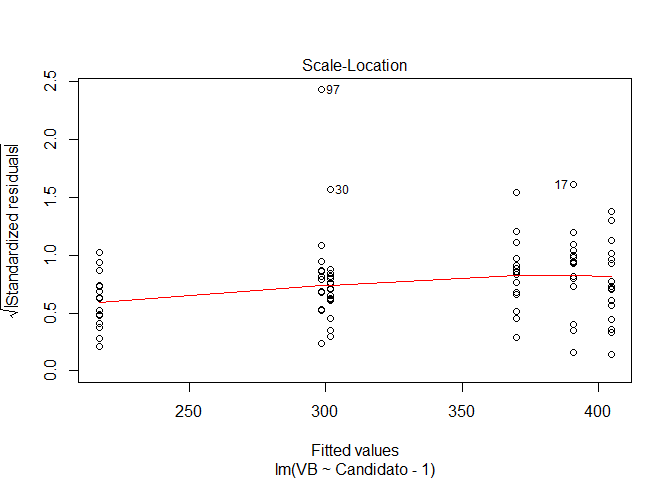<!-- --><!-- -->

#### Considerações Modelo Geral

No gráfico "Residual vs. Fitted" os resíduos estão igualmente espalhados em torno de uma linha horizontal sem padrões distintos, o que é uma indicação de que não possui relações não lineares.  

O gráfico "Q-Q" dos resíduos padronizados indica que os pontos caem ao longo de uma linha no meio do gráfico, mas se curvam nas extremidades. Os gráficos Q-Q normais que exibem esse comportamento geralmente mostam que os dados têm valores mais extremos do que seria esperado de uma distribuição Normal.

O gráfico "Scale-Location" indica a suposição de igual variação (homoscedasticidade), devido a linha horizontal com pontos de dispersão aleatórios, com alterações mínimas.

### Análise ANOVA modelo Positivo


```r
VBPositivo <- .Anova(TidyP)
summary(VBPositivo)
```

```
## 
## Call:
## lm(formula = VB ~ Candidato - 1, data = z)
## 
## Residuals:
##    Min     1Q Median     3Q    Max 
## -577.3 -285.1 -146.6  147.7 2022.7 
## 
## Coefficients:
##                    Estimate Std. Error t value Pr(>|t|)    
## CandidatoALCKMIN      390.7      108.5   3.600 0.000550 ***
## CandidatoBOLSONARO    600.3      108.5   5.531 3.88e-07 ***
## CandidatoCIRO         404.6      108.5   3.728 0.000359 ***
## CandidatoHADDAD       217.1      108.5   2.000 0.048885 *  
## CandidatoMARINA       370.1      108.5   3.410 0.001021 ** 
## ---
## Signif. codes:  0 '***' 0.001 '**' 0.01 '*' 0.05 '.' 0.1 ' ' 1
## 
## Residual standard error: 447.5 on 80 degrees of freedom
## Multiple R-squared:  0.4774,	Adjusted R-squared:  0.4447 
## F-statistic: 14.62 on 5 and 80 DF,  p-value: 3.644e-10
```

```r
anova(VBPositivo)
```

```
## Analysis of Variance Table
## 
## Response: VB
##           Df   Sum Sq Mean Sq F value    Pr(>F)    
## Candidato  5 14632815 2926563  14.617 3.644e-10 ***
## Residuals 80 16017633  200220                      
## ---
## Signif. codes:  0 '***' 0.001 '**' 0.01 '*' 0.05 '.' 0.1 ' ' 1
```

```r
plot(VBPositivo)
```

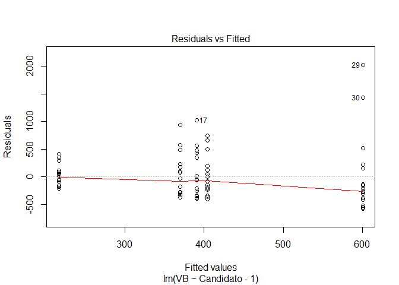<!-- -->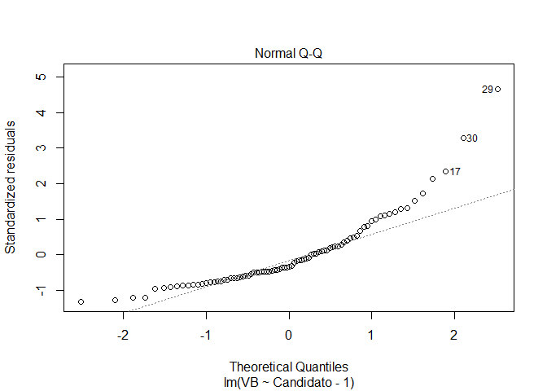<!-- -->

```
## hat values (leverages) are all = 0.05882353
##  and there are no factor predictors; no plot no. 5
```

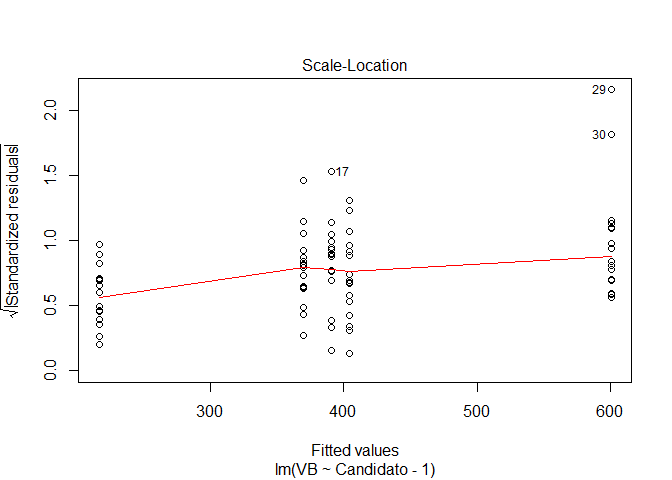<!-- --><!-- -->

#### Considerações Modelo Positivo

No gráfico "Residual vs. Fitted" os resíduos estão igualmente espalhados em torno de uma linha horizontal sem padrões distintos, o que é uma indicação de que não possui relações não lineares.

O mesmo resultado do gráfico "Q-Q" dos resíduos padronizados do modelo geral foi obtido do modelo positivo. O gráfico indica  que os dados têm valores mais extremos do que seria esperado de uma distribuição Normal.

O gráfico "Scale-Location" indica a suposição de igual variação (homoscedasticidade), devido a linha horizontal com pontos de dispersão aleatórios, com alterações mínimas.

### Análise ANOVA modelo Negativo


```r
VBNegativo <- .Anova(TidyNo)
summary(VBNegativo)
```

```
## 
## Call:
## lm(formula = VB ~ Candidato - 1, data = z)
## 
## Residuals:
##    Min     1Q Median     3Q    Max 
## -182.8 -136.2  -12.8  117.0  381.2 
## 
## Coefficients:
##                    Estimate Std. Error t value Pr(>|t|)   
## CandidatoALCKMIN     189.20      72.68   2.603  0.01701 * 
## CandidatoBOLSONARO   168.40      72.68   2.317  0.03122 * 
## CandidatoCIRO        223.80      72.68   3.079  0.00592 **
## CandidatoHADDAD      106.80      72.68   1.469  0.15726   
## CandidatoMARINA      221.00      72.68   3.041  0.00645 **
## ---
## Signif. codes:  0 '***' 0.001 '**' 0.01 '*' 0.05 '.' 0.1 ' ' 1
## 
## Residual standard error: 162.5 on 20 degrees of freedom
## Multiple R-squared:  0.6229,	Adjusted R-squared:  0.5286 
## F-statistic: 6.607 on 5 and 20 DF,  p-value: 0.00088
```

```r
anova(VBNegativo)
```

```
## Analysis of Variance Table
## 
## Response: VB
##           Df Sum Sq Mean Sq F value  Pr(>F)    
## Candidato  5 872444  174489  6.6067 0.00088 ***
## Residuals 20 528218   26411                    
## ---
## Signif. codes:  0 '***' 0.001 '**' 0.01 '*' 0.05 '.' 0.1 ' ' 1
```

```r
plot(VBNegativo)
```

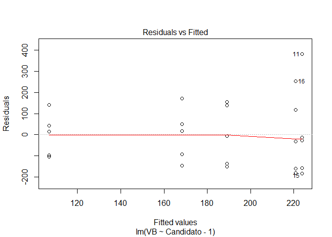<!-- -->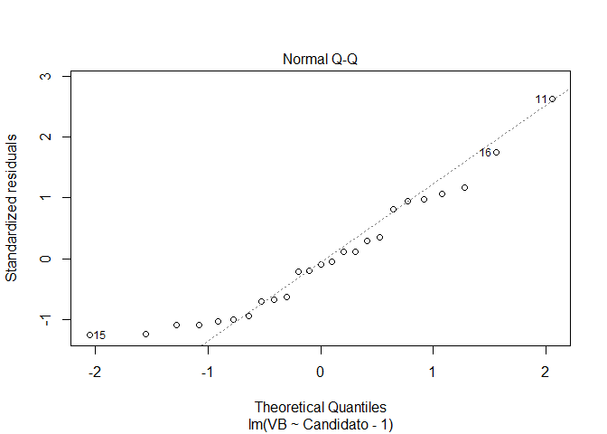<!-- -->

```
## hat values (leverages) are all = 0.2
##  and there are no factor predictors; no plot no. 5
```

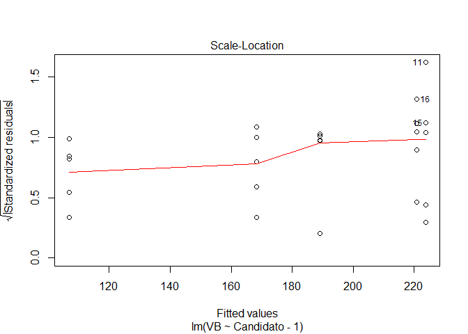<!-- --><!-- -->

#### Considerações Modelo negativo

O gráfico "Residual vs. Fitted" indíca que os pontos não possui relações não lineares.  

O gráfico "Q-Q" dos resíduos padronizados indica uma suposição bastante segura. Os pontos parecem cair sobre uma linha reta em que o eixo x plota os quantis teóricos. Esses são os quantis da distribuição normal padrão com média 0 e desvio padrão 1.

O gráfico "Scale-Location" indica a suposição de igual variação (homoscedasticidade), devido a linha horizontal com pontos de dispersão aleatórios, com alterações mínimas.

### Análise ANOVA modelo Neutro


```r
VBNeutro <- .Anova(TidyN)
summary(VBNeutro)
```

```
## 
## Call:
## lm(formula = VB ~ Candidato - 1, data = z)
## 
## Residuals:
##     Min      1Q  Median      3Q     Max 
## -841.57 -337.57  -38.57  119.14 1463.43 
## 
## Coefficients:
##                    Estimate Std. Error t value Pr(>|t|)    
## CandidatoALCKMIN      513.6      196.5   2.613   0.0139 *  
## CandidatoBOLSONARO   1159.6      196.5   5.900 1.84e-06 ***
## CandidatoCIRO         452.4      196.5   2.302   0.0284 *  
## CandidatoHADDAD       250.6      196.5   1.275   0.2121    
## CandidatoMARINA       452.9      196.5   2.304   0.0283 *  
## ---
## Signif. codes:  0 '***' 0.001 '**' 0.01 '*' 0.05 '.' 0.1 ' ' 1
## 
## Residual standard error: 520 on 30 degrees of freedom
## Multiple R-squared:  0.6423,	Adjusted R-squared:  0.5827 
## F-statistic: 10.78 on 5 and 30 DF,  p-value: 5.357e-06
```

```r
anova(VBNeutro)
```

```
## Analysis of Variance Table
## 
## Response: VB
##           Df   Sum Sq Mean Sq F value    Pr(>F)    
## Candidato  5 14566431 2913286  10.775 5.357e-06 ***
## Residuals 30  8111174  270372                      
## ---
## Signif. codes:  0 '***' 0.001 '**' 0.01 '*' 0.05 '.' 0.1 ' ' 1
```

```r
plot(VBNeutro)
```

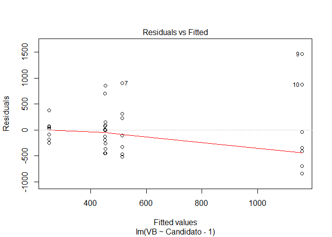<!-- -->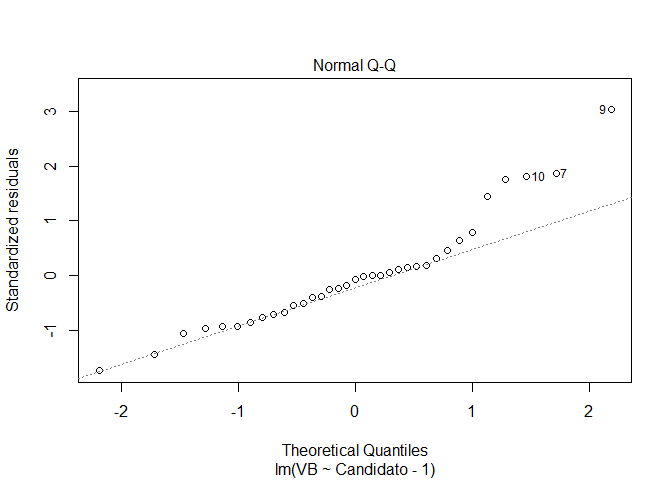<!-- -->

```
## hat values (leverages) are all = 0.1428571
##  and there are no factor predictors; no plot no. 5
```

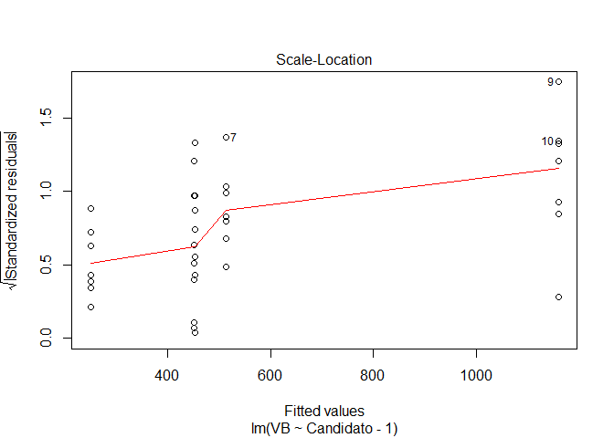<!-- --><!-- -->

#### Considerações Modelo Neutro

No gráfico "Residual vs. Fitted" os resíduos estão igualmente espalhados em torno de uma linha horizontal sem padrões distintos, o que é uma indicação de que não possui relações não lineares.

O gráfico "Q-Q" dos resíduos padronizados indica que os dados estão em uma distribuição normal, com poucos pontos de perturbação.

O gráfico "Scale-Location" indica a suposição de igual variação (homoscedasticidade), devido a linha horizontal com pontos de dispersão aleatórios, com alterações mínimas.


# Conclusões

Os dados coletados mostram que há significância no diferencial do tratamento das imagens entre os candidatos avaliados.

A ordem de candidatos que mais tiveram benefícios de Visual Bias Positivo é a seguinte (sendo 1-mais benefício, e 5 menos benefício):
1- Bolsonaro
2- Ciro
3- Alckimin
4- Marina
5- Haddad

A ordem de candidatos que mais tiveram prejuízos de Visual Bias negativo é a seguinte (sendo 1-mais prejuízo, e 5 menos prejuízo):
1- Ciro
2- Marina
3- Alckimin
4- Bolsonaro
5- Haddad

A ordem de candidatos que foram filmados de Visual Bias neutro é a seguinte (sendo 1-mais enquadramento neutro, e 5 menos enquadramento neutro):
1- Bolsonaro
2- Alckimin
3- Marina
4- Ciro
5- Haddad

Os testes indicam homoscedasticidade nos dados em uma distribuição linear com alguns pontos extremos de distribuição, os quais podem ser característicos das amostras, contudo, sem prejuízo a qualidade dos dados. 

# Referências

Becker, J. L. Estatística Básica: transformando dados em informação. Porto Alegre: Editora Bookman, 488 p. 2015.

Casella, G. & Berger, R. L. Inferência Estatística. São Paulo: Cengage Learning, 588 p. 2010.

Sant'Ana, R. Análise de Variância (ANOVA). UNIVALI / CTTMar / GEP.
Disponível em http://lite.acad.univali.br/rcurso/anova/#Realizando_a_an_lise_no_R

Guimarães, A. M. 2019. Análise de Variância (ANOVA) one-way e Tukey usando R. Disponível em: https://medium.com/omixdata/an%C3%A1lise-de-vari%C3%A2ncia-anova-one-way-e-tukey-usando-r-f91b6f79240e
Vieira, S. Análise de Variância (ANOVA). São Paulo: Editora Atlâs, 204 p. 2006

