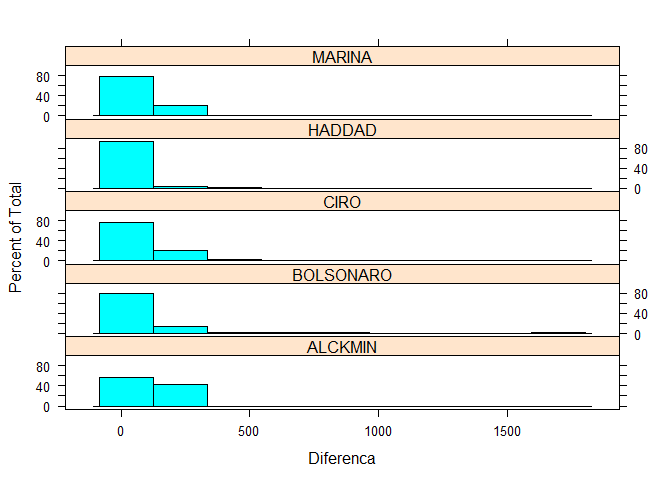
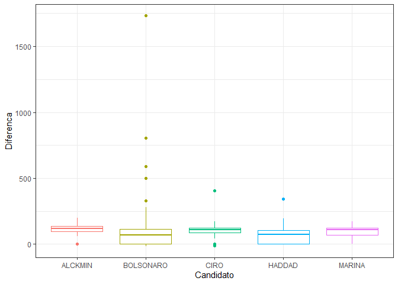
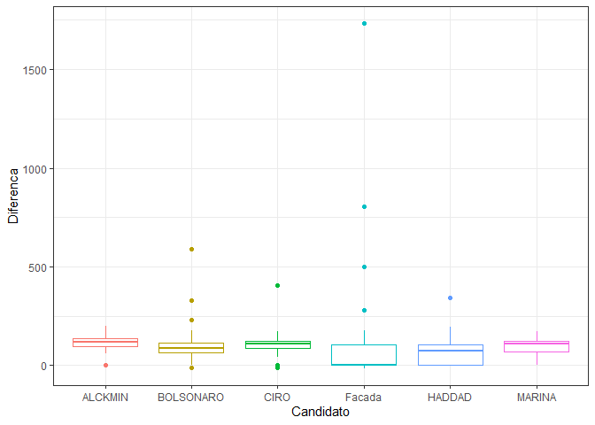
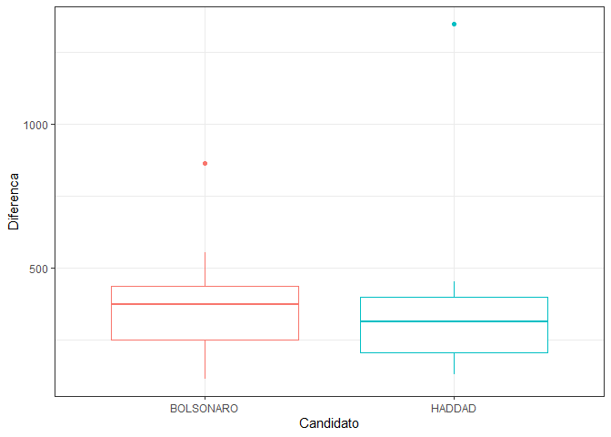

```r
knitr::opts_chunk$set(
	echo = TRUE,
	message = FALSE,
	warning = FALSE,
	cache = TRUE
)
setwd("~/ANOVA")

# Pacotes e Funções
library(tidyverse) # Manipulacao eficiente de dados
```

```
## -- Attaching packages ----------------------------------------------------------------------- tidyverse 1.3.0 --
```

```
## v ggplot2 3.3.0     v purrr   0.3.4
## v tibble  3.0.1     v dplyr   0.8.5
## v tidyr   1.0.2     v stringr 1.4.0
## v readr   1.3.1     v forcats 0.5.0
```

```
## Warning: package 'ggplot2' was built under R version 3.6.3
```

```
## Warning: package 'tibble' was built under R version 3.6.3
```

```
## Warning: package 'tidyr' was built under R version 3.6.3
```

```
## Warning: package 'purrr' was built under R version 3.6.3
```

```
## Warning: package 'dplyr' was built under R version 3.6.3
```

```
## Warning: package 'forcats' was built under R version 3.6.3
```

```
## -- Conflicts -------------------------------------------------------------------------- tidyverse_conflicts() --
## x dplyr::filter() masks stats::filter()
## x dplyr::lag()    masks stats::lag()
```

```r
library(ggplot2)
library(dplyr)
library(pdftools)
```

```
## Warning: package 'pdftools' was built under R version 3.6.3
```

```r
library(RRPP)
```

```
## Warning: package 'RRPP' was built under R version 3.6.3
```

```r
library(plotrix)
```

```
## Warning: package 'plotrix' was built under R version 3.6.3
```

```r
library(purrr)
```


# Análise de variância Primeiro turno

A Análise de Variância, ou ANOVA, é um teste paramétrico. Ela testa a hipótese de que a média de duas ou mais populações são iguais, servindo assim como uma ferramenta que auxilia o pesquisador a avaliar a importância de um ou mais fatores, comparando as médias das variáveis resposta em diferentes diferentes grupos. A variação que se vai verificar refere-se a diferença entre quadros dos Candidatos, e segue a fórmula abaixo:

Diferença = $(Positivo * 0.7 + Neutro * 0.3) - Negativo$  

O critério de classificação  são os candidatos como variável categórica, sendo utilizado ANOVA One way.

O princípio utilizado pela ANOVA para determinar a diferença entre médias é baseada na análise de dois elementos da amostra: (i) a variação entre as médias dos grupos analisados; (ii) a variação em relação às amostras dentro do mesmo grupo.

Temos que:

SQ(total) = SQ(entre) + SQ(dentro)
Onde:

SQ(total) ou soma total de quadrados: é uma medida da variação total(em torno de x) em todos os dados amostrais combinados;

SQ(entre): é uma medida da variação entre as médias amostrais combinados.

Matematicamente calculamos o SQ(entre) da seguinte maneira:


```r
library(readxl)
TidyN_1oturno_valendo <- read_excel("TidyN-1oturno_valendo.xlsx")
TidyN_2oturno <- read_excel("TidyN_2oturno.xlsx")
TidyN_1oturno_valendo_F_e_B <- read_excel("TidyN-1oturno_valendo_F_e_B.xlsx")

Tidy_Calculado_1T <-
           TidyN_1oturno_valendo %>%
           mutate(Diferenca = Positivo + Neutro - Negativo)

Tidy_Calculado_1T_BF <-
           TidyN_1oturno_valendo_F_e_B %>%
           mutate(Diferenca = Positivo + Neutro - Negativo)

Tidy_Calculado_2T <-
           TidyN_2oturno %>%
           mutate(Diferenca = Positivo + Neutro - Negativo)
```


## Modelo de análise

O modelo de análise refere-se ao candidado como 


```r
modelo <- aov(Positivo + Neutro - Negativo ~ Candidato, data = Tidy_Calculado_1T_BF)
modelo
```

```
## Call:
##    aov(formula = Positivo + Neutro - Negativo ~ Candidato, data = Tidy_Calculado_1T_BF)
## 
## Terms:
##                 Candidato Residuals
## Sum of Squares      87566   4437884
## Deg. of Freedom         4       238
## 
## Residual standard error: 136.5524
## Estimated effects may be unbalanced
```


- Em Call mostra a fórmula usada para executar a ANOVA

- Em Terms, a primeira coluna é referente as análises dentro dos grupos e a segunda coluna referente as análises entre os grupos

- Sum of Squares : soma dos quadrados

- Df: graus de liberdade

- Residual standard error: Erro padrão dos resíduos. Calculado a partir da raiz quadrada da divisão entre a soma dos quadrados dos resíduos e seus graus de liberdade.

### Sumário do modelo


```r
summary(modelo)
```

```
##              Df  Sum Sq Mean Sq F value Pr(>F)
## Candidato     4   87566   21891   1.174  0.323
## Residuals   238 4437884   18647
```

Acima há os seguintes dados:

- Mean sq: quadrados médios.

- F value: estatística F.

- Pr(>F): valor-p para a estatística F.

A partir da estatística F e seu valor-p abaixo de 0.05 podemos temos embasamento estatístico para afirmar com grande confiança que as médias das diferenças difere significantemente por candidato. Neste caso não há diferença significativa.

## Testando as premissas da ANOVA

O resultado da ANOVA só é robusto se as premissas do testes forem satisfeitas. 

### Homogeneidade das amostras

A homogeneidade testa se os dados são adequados. O Teste de Levene para homocedasticia é o mais adequando. 


```
## Levene's Test for Homogeneity of Variance (center = "mean")
##        Df F value   Pr(>F)   
## group   4  4.7049 0.001134 **
##       238                    
## ---
## Signif. codes:  0 '***' 0.001 '**' 0.01 '*' 0.05 '.' 0.1 ' ' 1
```

A hipótese nula do Teste de Levene é de que não há diferença entre as variâncias dos grupos de candidatos. O valor-p maior do que 0.05 dá uma confiança estatística para afirmar que as variâncias são de fato iguais e portanto os dados são homogêneos. No resultado acima não há homogenidade.


### Normalidade dos resíduos

A premissa de normalidade dos resíduos na ANOVA é testada com o teste de Shapiro-Wilk:


```
## 
## 	Shapiro-Wilk normality test
## 
## data:  resid(modelo)
## W = 0.45027, p-value < 2.2e-16
```

A hipótese nula do Teste de Shapiro-Wilk é de que não há diferença entre a distribuição dos dados e a distribuição normal. O valor-p maior do que 0.05 nos dá uma confiança estatística para afirmar que as distribuição dos resíduos não difere da distribuição normal.

Os histogramas abaixo confirmam a falta de normalidade dos dados.


```r
library(lattice)

histogram(~ Diferenca | Candidato,
          data=Tidy_Calculado_1T_BF,
          layout=c(1,5)) 
```

<!-- -->


### Conclusão dos testes com ANOVA

Dessa forma os dados não satisfazem todas as premissas da ANOVA e portanto, o resultado da ANOVA podem ser totalmente válidos.

Como alternativa será utilizado um teste não paramétrico é um teste de hipótese de que não requer que a distribuição da população seja caracterizada com uma distribuição normal com parâmetros μ e σ. Os testes não paramétricos não têm essa suposição, de forma que eles são úteis quando os dados são fortemente não normais e resistentes à transformação.
Uma alternativa a ANOVA é o teste de KRUSKAL-WALLIS, que analisa a variância entre 2 ou mais grupo.

## Análise de variância com KRUSKAL-WALLIS


```
## 
## 	Kruskal-Wallis rank sum test
## 
## data:  Diferenca by Candidato
## Kruskal-Wallis chi-squared = 31.788, df = 4, p-value = 2.114e-06
```

O p-value é menor que o nível de significância 0.05, por isso conclui-se que que as médias das diferenças são significantes.


Abaixo é possível verificar as médias das diferenças por candidatos, sendo que a facada foi somada ao Bolsonaro.


```
##   Candidato Diferenca
## 1   ALCKMIN     120.0
## 2 BOLSONARO      70.0
## 3      CIRO     110.5
## 4    HADDAD      72.0
## 5    MARINA     107.5
```

Abaixo é possível verificar as médias das diferenças por candidatos, sendo que a facada foi separada do Bolsonaro.


```
##   Candidato Diferenca
## 1   ALCKMIN     120.0
## 2 BOLSONARO      88.0
## 3      CIRO     110.5
## 4    Facada       0.0
## 5    HADDAD      72.0
## 6    MARINA     107.5
```


No gráfico abaixo é possivel ver essa diferença entre os candidatos, em que a facada foi somada a pontuação do Bolsonaro.

<!-- -->


No gráfico abaixo é possivel ver essa diferença entre os candidatos, em que a facada separada da pontuação do Bolsonaro.

<!-- -->


Abaixo e teste que compara todos os candidatos. 


```
## 
## 	Pairwise comparisons using Wilcoxon rank sum test 
## 
## data:  Tidy_Calculado_1T_BF$Diferenca and Tidy_Calculado_1T_BF$Candidato 
## 
##           ALCKMIN BOLSONARO CIRO    HADDAD 
## BOLSONARO 0.00097 -         -       -      
## CIRO      0.27117 0.00700   -       -      
## HADDAD    6e-05   0.42502   0.00048 -      
## MARINA    0.07000 0.03260   0.52814 0.00150
## 
## P value adjustment method: BH
```

Há diferenças significativas em todos os valores menores que 0.05, os quais são apresentados na matriz acima. A matriz deve ser lida comparando coluna com linha.Ex.: entre Marina e Ciro, Ciro e Alckmin, Haddad e Bolsonaro não há diferença significativa. Todos os outros ha diferenças significativas nos valores calculados.

Abaixo o teste é feito separando da facada de bolsonaro


```
## 
## 	Pairwise comparisons using Wilcoxon rank sum test 
## 
## data:  Tidy_Calculado_1T$Diferenca and Tidy_Calculado_1T$Candidato 
## 
##           ALCKMIN BOLSONARO CIRO    Facada  HADDAD 
## BOLSONARO 0.01170 -         -       -       -      
## CIRO      0.27117 0.08639   -       -       -      
## Facada    0.00208 0.01170   0.00312 -       -      
## HADDAD    9e-05   0.05738   0.00071 0.35940 -      
## MARINA    0.07349 0.32635   0.52814 0.00442 0.00224
## 
## P value adjustment method: BH
```

## Conclusão do Primeiro turno

Somando os enquadramentos positivos e neutros e diminuindo os enquadramentos negativos, os candidatos mais beneficiados no primeiro turno foram Alckmin, Ciro e Marina. 


# Test t no Segundo turno

Abaixo a agregação dos candidatos do segundo turno, calculando-se as médias. Há uma diferença entre as médias do modelo, Diferença = $(Positivo * 0.7 + Neutro * 0.3) - Negativo$, conforme vemos abaixo. Agora vamos calcular com o Teste t se essa diferença é estatisticamente significante.


```
##   Candidato Diferenca
## 1 BOLSONARO     370.5
## 2    HADDAD     311.0
```


Abaixo o test t de Student, que compara a significância da diferença de enquadramento entre Bolsonaro e Hadad, no segundo turno.


```
## 
## 	Welch Two Sample t-test
## 
## data:  Bolsonaro$Diferenca and Haddad$Diferenca
## t = 0.0093512, df = 28.589, p-value = 0.9926
## alternative hypothesis: true difference in means is not equal to 0
## 95 percent confidence interval:
##  -164.9892  166.5039
## sample estimates:
## mean of x mean of y 
##  359.8750  359.1176
```

No gráfico é possível notar que Bolsonaro foi levemente beneficiado, tendo uma Diferença com a média um pouco maior que Haddad. Contudo, conforme descrito acima, essa diferença não é estatísticamente significante.

<!-- -->


## Conclusão do segundo turno

Apesar de haver diferença nas médias dos candidatos, essa diferença não é significativa estatisticamente. Assim, não é possivel afirmar que algum candidato tenha sido beneficiado com os enquadramentos do JN.
