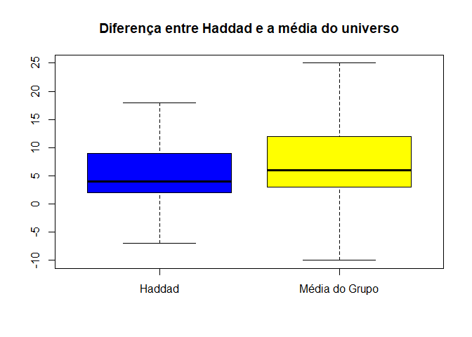
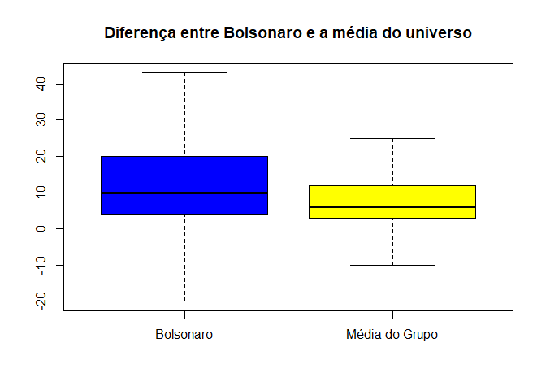
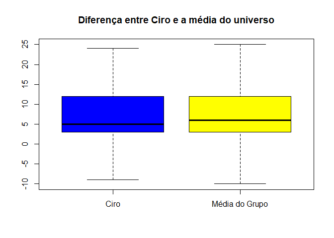
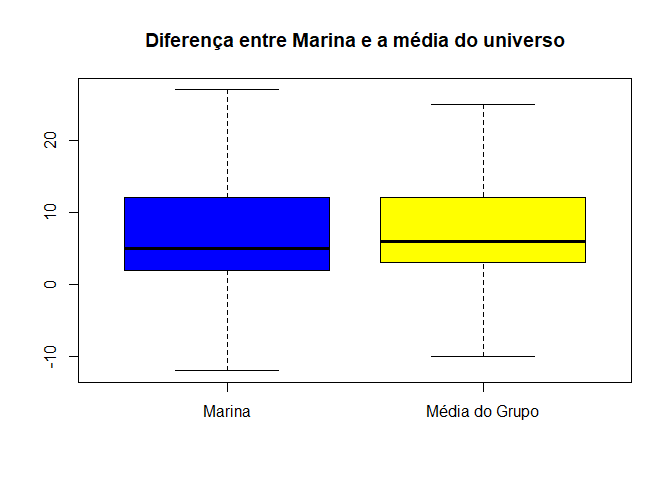
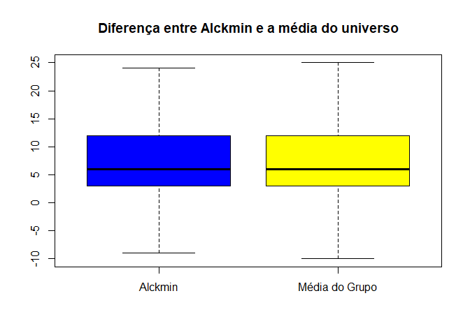
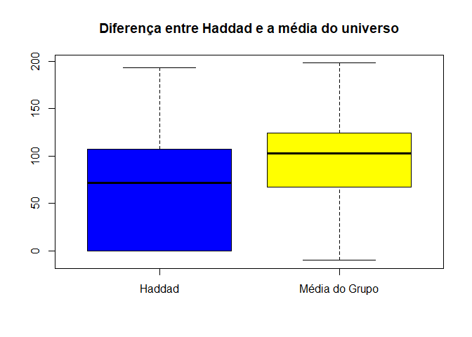
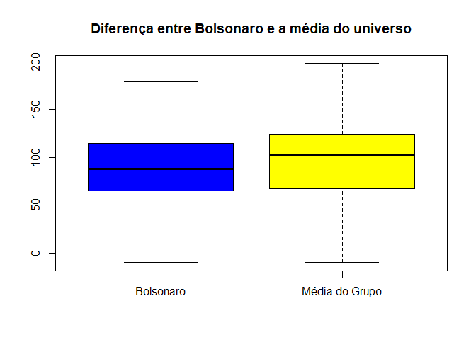
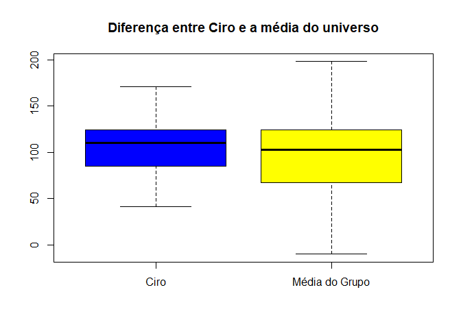
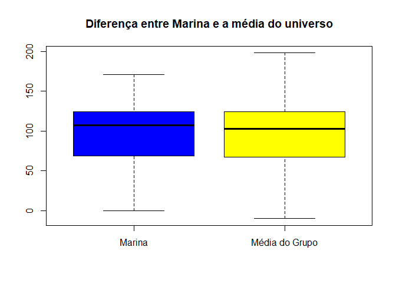
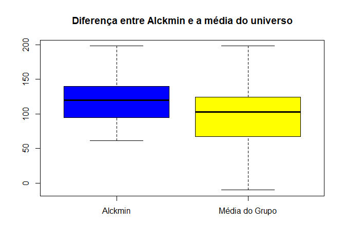

```r
knitr::opts_chunk$set(
	echo = TRUE,
	message = FALSE,
	warning = FALSE)
setwd("~/ANOVA")

# Pacotes e Funções
library(tidyverse) # Manipulacao eficiente de dados
```

```
## -- Attaching packages ------------------------------------------ tidyverse 1.3.0 --
```

```
## v ggplot2 3.3.0     v purrr   0.3.4
## v tibble  3.0.1     v dplyr   0.8.5
## v tidyr   1.0.2     v stringr 1.4.0
## v readr   1.3.1     v forcats 0.5.0
```

```
## Warning: package 'ggplot2' was built under R version 3.6.3
```

```
## Warning: package 'tibble' was built under R version 3.6.3
```

```
## Warning: package 'tidyr' was built under R version 3.6.3
```

```
## Warning: package 'purrr' was built under R version 3.6.3
```

```
## Warning: package 'dplyr' was built under R version 3.6.3
```

```
## Warning: package 'forcats' was built under R version 3.6.3
```

```
## -- Conflicts --------------------------------------------- tidyverse_conflicts() --
## x dplyr::filter() masks stats::filter()
## x dplyr::lag()    masks stats::lag()
```

```r
library(ggplot2)
library(dplyr)
library(pdftools)
```

```
## Warning: package 'pdftools' was built under R version 3.6.3
```

```r
library(RRPP)
```

```
## Warning: package 'RRPP' was built under R version 3.6.3
```

```r
library(plotrix)
```

```
## Warning: package 'plotrix' was built under R version 3.6.3
```

```r
library(purrr)
```

# Contexto do estudo

 Neste estudo foram realizados diversos testes para verificar a hipótese de que há diferença estatisticamente significante no enquadramento de candidatos á presidência no Brasil. Não foi possível aplicar ANOVA, devido a grande quantidade de valores zerados, ou seja, os dados não possuem curva normal, sendo que a aplicação desses testes não seria válida. Foi então escolhido então teste t de Student para a distribuição por PLANOS e  na distribuição por DIA foi escolhido um teste para dados não paramétricos, o teste Wilcoxon.


# POR PLANO - Teste t de Student - Primeiro turno 

A diferença é calculada com  a fórmula abaixo:

$Diferença = Positivo + Neutro - Negativo$  

Sendo os dados distribuídos por PLANO, os quais podem ter diversos valores por dia


## Médias da diferença de todos os candidatos


```r
DT::datatable(aggregate(Diferenca ~ Candidato, data = Tidy_Calculado_1T, mean))
```

<!--html_preserve--><div id="htmlwidget-b836a25ebcb386ba802c" style="width:100%;height:auto;" class="datatables html-widget"></div>
<script type="application/json" data-for="htmlwidget-b836a25ebcb386ba802c">{"x":{"filter":"none","data":[["1","2","3","4","5"],["ALCKMIN","BOLSONAROfacada","CIRO","HADDAD","MARINA"],[10.1931330472103,18.3247311827957,10.9692671394799,10.5725806451613,9.78657074340528]],"container":"<table class=\"display\">\n  <thead>\n    <tr>\n      <th> <\/th>\n      <th>Candidato<\/th>\n      <th>Diferenca<\/th>\n    <\/tr>\n  <\/thead>\n<\/table>","options":{"columnDefs":[{"className":"dt-right","targets":2},{"orderable":false,"targets":0}],"order":[],"autoWidth":false,"orderClasses":false}},"evals":[],"jsHooks":[]}</script><!--/html_preserve-->

## Média do Universo

A média do universo é descrita abaixo


```r
m <- mean(Tidy_Calculado_1T$Diferenca)
m
```

```
## [1] 12.19118
```


## Teste Haddad 1T

Testando a hipótese que Haddad tem a diferença de Positivo + Neutro - Negativo menor que a média do universo.


```r
Haddad <- Tidy_Calculado_1T %>%
             filter(Candidato == "HADDAD")
          

t.test(Haddad$Diferenca, mu=m)
```

```
## 
## 	One Sample t-test
## 
## data:  Haddad$Diferenca
## t = -1.3878, df = 247, p-value = 0.1664
## alternative hypothesis: true mean is not equal to 12.19118
## 95 percent confidence interval:
##   8.275435 12.869727
## sample estimates:
## mean of x 
##  10.57258
```

A média de Haddad é estatisticamente igual a média do universo, segundo o teste t de Student.


```r
boxplot(Haddad$Diferenca, Tidy_Calculado_1T$Diferenca, 
        outline = FALSE,
        names = c("Haddad", "Média do Grupo"),  
        col = c("blue", "yellow"), 
        main = "Diferença entre Haddad e a média do universo")
```

<!-- -->

## Teste Bolsonaro 1T - facada e Bolsonaro

Testando a hipótese que Bolsonaro mais os enquadramentos da facada somados, tem a diferença de Positivo + Neutro - Negativo maior que a média do universo.


```r
Bolsonaro <- Tidy_Calculado_1T %>%
             filter(Candidato == "BOLSONAROfacada")
          

t.test(Bolsonaro$Diferenca, mu=m)
```

```
## 
## 	One Sample t-test
## 
## data:  Bolsonaro$Diferenca
## t = 3.887, df = 464, p-value = 0.0001163
## alternative hypothesis: true mean is not equal to 12.19118
## 95 percent confidence interval:
##  15.22389 21.42557
## sample estimates:
## mean of x 
##  18.32473
```

A média de Bolsonaro é maior que a média do universo, e essa diferença é estatisticamente significante, segundo o teste t de Student.


```r
boxplot(Bolsonaro$Diferenca, Tidy_Calculado_1T$Diferenca, 
        outline = FALSE,
        names = c("Bolsonaro", "Média do Grupo"),  
        col = c("blue", "yellow"), 
        main = "Diferença entre Bolsonaro e a média do universo")
```

<!-- -->

## Teste Ciro 1T

Testando a hipótese que Ciro tem a diferença de Positivo + Neutro - Negativo maior que a média do universo.


```r
Ciro <- Tidy_Calculado_1T %>%
             filter(Candidato == "CIRO")
          

t.test(Ciro$Diferenca, mu=m)
```

```
## 
## 	One Sample t-test
## 
## data:  Ciro$Diferenca
## t = -1.3648, df = 422, p-value = 0.173
## alternative hypothesis: true mean is not equal to 12.19118
## 95 percent confidence interval:
##   9.209421 12.729113
## sample estimates:
## mean of x 
##  10.96927
```


A média de Ciro é estatisticamente igual a média do universo, segundo o teste t de Student.


```r
boxplot(Ciro$Diferenca, Tidy_Calculado_1T$Diferenca, 
        outline = FALSE,
        names = c("Ciro", "Média do Grupo"),  
        col = c("blue", "yellow"), 
        main = "Diferença entre Ciro e a média do universo")
```

<!-- -->


## Teste Marina 1T

Testando a hipótese que Marina tem a diferença de Positivo + Neutro - Negativo maior que a média do universo.


```r
Marina <- Tidy_Calculado_1T %>%
             filter(Candidato == "MARINA")
          

t.test(Marina$Diferenca, mu=m)
```

```
## 
## 	One Sample t-test
## 
## data:  Marina$Diferenca
## t = -2.9349, df = 416, p-value = 0.003522
## alternative hypothesis: true mean is not equal to 12.19118
## 95 percent confidence interval:
##   8.176028 11.397113
## sample estimates:
## mean of x 
##  9.786571
```


A média de Marina é estatisticamente menor que a média do universo, segundo o teste t de Student.


```r
boxplot(Marina$Diferenca, Tidy_Calculado_1T$Diferenca, 
        outline = FALSE,
        names = c("Marina", "Média do Grupo"),  
        col = c("blue", "yellow"), 
        main = "Diferença entre Marina e a média do universo")
```

<!-- -->


## Teste Alckmin 1T

Testando a hipótese que Alkimin tem a diferença de Positivo + Neutro - Negativo menor que a média do universo.


```r
Alckmin <- Tidy_Calculado_1T %>%
             filter(Candidato == "ALCKMIN")
          

t.test(Alckmin$Diferenca, mu=m)
```

```
## 
## 	One Sample t-test
## 
## data:  Alckmin$Diferenca
## t = -2.7652, df = 465, p-value = 0.005915
## alternative hypothesis: true mean is not equal to 12.19118
## 95 percent confidence interval:
##   8.773231 11.613035
## sample estimates:
## mean of x 
##  10.19313
```


A média de Alckmin é estatisticamente menor que a média do universo, segundo o teste t de Student.


```r
boxplot(Alckmin$Diferenca, Tidy_Calculado_1T$Diferenca, 
        outline = FALSE,
        names = c("Alckmin", "Média do Grupo"),  
        col = c("blue", "yellow"), 
        main = "Diferença entre Alckmin e a média do universo")
```

<!-- -->


## Conclusão do Primeiro turno por Plano

Somando os enquadramentos positivos e neutros e diminuindo os enquadramentos negativos com a distribuição dos dados por PLANO, o candidato mais beneficiado no primeiro turno foi Bolsonaro. Bolsonaro foi o único candidato que teve a média da diferença (Posito + Neutro - Negativo por PLANO) estatisticamente maior que a média do universo, utilizando o teste i de Student. 


# POR DIA - Teste Wilcoxon - Primeiro turno 

O teste Wilcoxon foi usado na distribuição por DIA devido a quantidade baixa e não normalização dos dados

A diferença é calculada com  a fórmula abaixo:

$Diferença = Positivo + Neutro - Negativo$  

Sendo que os dados foram agregados por DIA.


## Médias da diferença de todos os candidatos


```r
DT::datatable(aggregate(Diferenca ~ Candidato, data = Tidy_Calculado_1T, mean))
```

<!--html_preserve--><div id="htmlwidget-0b51ccb541c6c2056fe4" style="width:100%;height:auto;" class="datatables html-widget"></div>
<script type="application/json" data-for="htmlwidget-0b51ccb541c6c2056fe4">{"x":{"filter":"none","data":[["1","2","3","4","5"],["ALCKMIN","BOLSONAROFacada","CIRO","HADDAD","MARINA"],[112.714285714286,103.214285714286,110,63.7380952380952,97.0952380952381]],"container":"<table class=\"display\">\n  <thead>\n    <tr>\n      <th> <\/th>\n      <th>Candidato<\/th>\n      <th>Diferenca<\/th>\n    <\/tr>\n  <\/thead>\n<\/table>","options":{"columnDefs":[{"className":"dt-right","targets":2},{"orderable":false,"targets":0}],"order":[],"autoWidth":false,"orderClasses":false}},"evals":[],"jsHooks":[]}</script><!--/html_preserve-->

## Média do Universo

A média do universo é descrita abaixo


```r
m <- mean(Tidy_Calculado_1T$Diferenca)
m
```

```
## [1] 97.35238
```


## Teste Haddad 1T

Testando a hipótese que Haddad tem a diferença de Positivo + Neutro - Negativo menor que a média do universo.


```r
Haddad <- Tidy_Calculado_1T %>%
             filter(Candidato == "HADDAD")
          

wilcox.test(Haddad$Diferenca, mu=m)
```

```
## 
## 	Wilcoxon signed rank test with continuity correction
## 
## data:  Haddad$Diferenca
## V = 195, p-value = 0.001251
## alternative hypothesis: true location is not equal to 97.35238
```

A média de Haddad é menor que a média do universo, e essa diferença é estatisticamente significante, segundo o teste Wilcoxon.


```r
boxplot(Haddad$Diferenca, Tidy_Calculado_1T$Diferenca, 
        outline = FALSE,
        names = c("Haddad", "Média do Grupo"),  
        col = c("blue", "yellow"), 
        main = "Diferença entre Haddad e a média do universo")
```

<!-- -->

## Teste Bolsonaro 1T - facada e Bolsonaro

Testando a hipótese que Bolsonaro mais os enquadramentos da facada somados, tem a diferença de Positivo + Neutro - Negativo maior que a média do universo.


```r
Bolsonaro <- Tidy_Calculado_1T %>%
             filter(Candidato == "BOLSONAROFacada")
          

wilcox.test(Bolsonaro$Diferenca, mu=m)
```

```
## 
## 	Wilcoxon signed rank test with continuity correction
## 
## data:  Bolsonaro$Diferenca
## V = 369, p-value = 0.3051
## alternative hypothesis: true location is not equal to 97.35238
```

A média de Bolsonaro é maior que a média do universo, mas essa diferença NÃO é estatisticamente significante, segundo o teste Wilcoxon.


```r
boxplot(Bolsonaro$Diferenca, Tidy_Calculado_1T$Diferenca, 
        outline = FALSE,
        names = c("Bolsonaro", "Média do Grupo"),  
        col = c("blue", "yellow"), 
        main = "Diferença entre Bolsonaro e a média do universo")
```

<!-- -->

## Teste Ciro 1T

Testando a hipótese que Ciro tem a diferença de Positivo + Neutro - Negativo maior que a média do universo.


```r
Ciro <- Tidy_Calculado_1T %>%
             filter(Candidato == "CIRO")
          

wilcox.test(Ciro$Diferenca, mu=m)
```

```
## 
## 	Wilcoxon signed rank test with continuity correction
## 
## data:  Ciro$Diferenca
## V = 597, p-value = 0.06982
## alternative hypothesis: true location is not equal to 97.35238
```


A média de Ciro é maior que a média do universo, mas a diferença NÃO é estatisticamente significante, segundo o teste Wilcoxon.


```r
boxplot(Ciro$Diferenca, Tidy_Calculado_1T$Diferenca, 
        outline = FALSE,
        names = c("Ciro", "Média do Grupo"),  
        col = c("blue", "yellow"), 
        main = "Diferença entre Ciro e a média do universo")
```

<!-- -->


## Teste Marina 1T

Testando a hipótese que Marina tem a diferença de Positivo + Neutro - Negativo maior que a média do universo.


```r
Marina <- Tidy_Calculado_1T %>%
             filter(Candidato == "MARINA")
          

wilcox.test(Marina$Diferenca, mu=m)
```

```
## 
## 	Wilcoxon signed rank test with continuity correction
## 
## data:  Marina$Diferenca
## V = 491, p-value = 0.6258
## alternative hypothesis: true location is not equal to 97.35238
```


A média de Marina é estatisticamente igual a média do universo, segundo o teste Wilcoxon.


```r
boxplot(Marina$Diferenca, Tidy_Calculado_1T$Diferenca, 
        outline = FALSE,
        names = c("Marina", "Média do Grupo"),  
        col = c("blue", "yellow"), 
        main = "Diferença entre Marina e a média do universo")
```

<!-- -->


## Teste Alckmin 1T

Testando a hipótese que Alkimin tem a diferença de Positivo + Neutro - Negativo menor que a média do universo.


```r
Alckmin <- Tidy_Calculado_1T %>%
             filter(Candidato == "ALCKMIN")
          

wilcox.test(Alckmin$Diferenca, mu=m)
```

```
## 
## 	Wilcoxon signed rank test with continuity correction
## 
## data:  Alckmin$Diferenca
## V = 686, p-value = 0.003434
## alternative hypothesis: true location is not equal to 97.35238
```


A média de Alckmin é maior que a média do universo e essa diferença É estatisticamente significante, segundo o teste Wilcoxon.


```r
boxplot(Alckmin$Diferenca, Tidy_Calculado_1T$Diferenca, 
        outline = FALSE,
        names = c("Alckmin", "Média do Grupo"),  
        col = c("blue", "yellow"), 
        main = "Diferença entre Alckmin e a média do universo")
```

<!-- -->


## Conclusão do Primeiro turno por DIA

Somando os enquadramentos positivos e neutros e diminuindo os enquadramentos negativos agregados por DIA, o candidato mais beneficiado no primeiro turno foi Alckmin, que foi o único candidato que teve a média da diferença (Positivo + Neutro - Negativo dispostos por dia) estatisticamente maior que a média do universo, utilizando o teste Wilcoxon (para amostras com dados não normalizados). 


