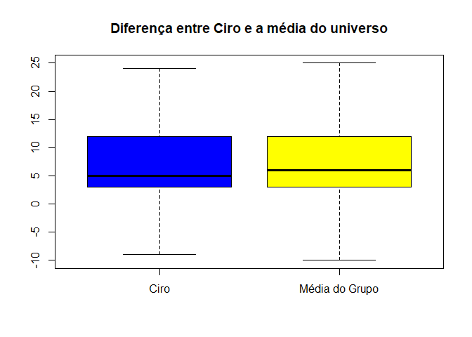
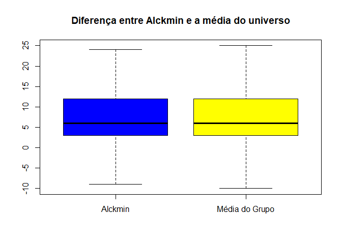
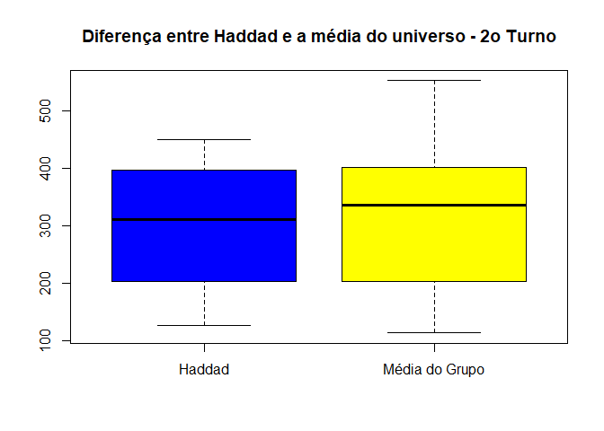
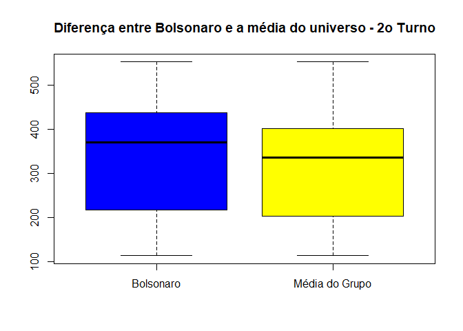

```r
knitr::opts_chunk$set(
	echo = TRUE,
	message = FALSE,
	warning = FALSE,
	cache = FALSE
)
setwd("~/ANOVA")

# Pacotes e Funções
library(tidyverse) # Manipulacao eficiente de dados
```

```
## -- Attaching packages --------------------------------------------------------- tidyverse 1.3.0 --
```

```
## v ggplot2 3.3.0     v purrr   0.3.4
## v tibble  3.0.1     v dplyr   0.8.5
## v tidyr   1.0.2     v stringr 1.4.0
## v readr   1.3.1     v forcats 0.5.0
```

```
## Warning: package 'ggplot2' was built under R version 3.6.3
```

```
## Warning: package 'tibble' was built under R version 3.6.3
```

```
## Warning: package 'tidyr' was built under R version 3.6.3
```

```
## Warning: package 'purrr' was built under R version 3.6.3
```

```
## Warning: package 'dplyr' was built under R version 3.6.3
```

```
## Warning: package 'forcats' was built under R version 3.6.3
```

```
## -- Conflicts ------------------------------------------------------------ tidyverse_conflicts() --
## x dplyr::filter() masks stats::filter()
## x dplyr::lag()    masks stats::lag()
```

```r
library(ggplot2)
library(dplyr)
library(pdftools)
```

```
## Warning: package 'pdftools' was built under R version 3.6.3
```

```r
library(RRPP)
```

```
## Warning: package 'RRPP' was built under R version 3.6.3
```

```r
library(plotrix)
```

```
## Warning: package 'plotrix' was built under R version 3.6.3
```

```r
library(purrr)
```

# Contexto do estudo

 Neste estudo foram realizados diversos testes para verificar a hipótese de que há diferença estatisticamente significante no enquadramento de candidatos á presidência no Brasil. Não foi possível aplicar ANOVA e test t devido a grande quantidade de valores zerados, ou seja, os dados não possuem curva normal, sendo que a aplicação desses testes não seria válida. Foi então escolhido um teste para dados não paramétricos para avaliar cada candidato com a média do univers, Teste Wilcoxon.


# Testando Hipóteses com Teste Wilcoxon - Primeiro turno

A diferença é calculada com  a fórmula abaixo:

$Diferença = Positivo + Neutro - Negativo$  


## Médias da diferença de todos os candidatos


```r
DT::datatable(aggregate(Diferenca ~ Candidato, data = Tidy_Calculado_1T, mean))
```

<!--html_preserve--><div id="htmlwidget-121753496c6952b1a158" style="width:100%;height:auto;" class="datatables html-widget"></div>
<script type="application/json" data-for="htmlwidget-121753496c6952b1a158">{"x":{"filter":"none","data":[["1","2","3","4","5"],["ALCKMIN","BOLSONARO","CIRO","HADDAD","MARINA"],[10.1931330472103,13.0290519877676,10.9692671394799,10.488,9.78657074340528]],"container":"<table class=\"display\">\n  <thead>\n    <tr>\n      <th> <\/th>\n      <th>Candidato<\/th>\n      <th>Diferenca<\/th>\n    <\/tr>\n  <\/thead>\n<\/table>","options":{"columnDefs":[{"className":"dt-right","targets":2},{"orderable":false,"targets":0}],"order":[],"autoWidth":false,"orderClasses":false}},"evals":[],"jsHooks":[]}</script><!--/html_preserve-->


## Teste Haddad 1T

Testando a hipótese que Haddad tem a diferença de Positivo + Neutro - Negativo menor que a média do universo.


```r
 m <- mean(Tidy_Calculado_1T$Diferenca)


Haddad <- Tidy_Calculado_1T %>%
             filter(Candidato == "HADDAD")
          

wilcox.test(Haddad$Diferenca, mu=m)
```

```
## 
## 	Wilcoxon signed rank test with continuity correction
## 
## data:  Haddad$Diferenca
## V = 7955, p-value = 1.366e-11
## alternative hypothesis: true location is not equal to 11.13756
```

A média de Haddad (10.488) é menor que a média do universo (11.13756), e essa diferença é estatisticamente significante, segundo o teste Wilcoxon.


```r
boxplot(Haddad$Diferenca, Tidy_Calculado_1T$Diferenca, 
        outline = FALSE,
        names = c("Haddad", "Média do Grupo"),  
        col = c("blue", "yellow"), 
        main = "Diferença entre Haddad e a média do universo")
```

<!-- -->

## Teste Bolsonaro 1T - facada e Bolsonaro

Testando a hipótese que Bolsonaro mais os enquadramentos da facada somados, tem a diferença de Positivo + Neutro - Negativo maior que a média do universo.


```r
Bolsonaro <- Tidy_Calculado_1T %>%
             filter(Candidato == "BOLSONARO")
          

wilcox.test(Bolsonaro$Diferenca, mu=m)
```

```
## 
## 	Wilcoxon signed rank test with continuity correction
## 
## data:  Bolsonaro$Diferenca
## V = 72989, p-value = 1.683e-12
## alternative hypothesis: true location is not equal to 11.13756
```

A média de Bolsonaro (13.02905) é maior que a média do universo (11.13756), e essa diferença é estatisticamente significante, segundo o teste Wilcoxon.


```r
boxplot(Bolsonaro$Diferenca, Tidy_Calculado_1T$Diferenca, 
        outline = FALSE,
        names = c("Bolsonaro", "Média do Grupo"),  
        col = c("blue", "yellow"), 
        main = "Diferença entre Bolsonaro e a média do universo")
```

<!-- -->

## Teste Ciro 1T

Testando a hipótese que Ciro tem a diferença de Positivo + Neutro - Negativo maior que a média do universo.


```r
Ciro <- Tidy_Calculado_1T %>%
             filter(Candidato == "CIRO")
          

t.test(Ciro$Diferenca, mu=m)
```

```
## 
## 	One Sample t-test
## 
## data:  Ciro$Diferenca
## t = -0.18797, df = 422, p-value = 0.851
## alternative hypothesis: true mean is not equal to 11.13756
## 95 percent confidence interval:
##   9.209421 12.729113
## sample estimates:
## mean of x 
##  10.96927
```


A média de Ciro (10.96927) é estatisticamente igual a média do universo (11.13756), segundo o teste Wilcoxon.


```r
boxplot(Ciro$Diferenca, Tidy_Calculado_1T$Diferenca, 
        outline = FALSE,
        names = c("Ciro", "Média do Grupo"),  
        col = c("blue", "yellow"), 
        main = "Diferença entre Ciro e a média do universo")
```

<!-- -->


## Teste Marina 1T

Testando a hipótese que Marina tem a diferença de Positivo + Neutro - Negativo maior que a média do universo.


```r
Marina <- Tidy_Calculado_1T %>%
             filter(Candidato == "MARINA")
          

wilcox.test(Marina$Diferenca, mu=m)
```

```
## 
## 	Wilcoxon signed rank test with continuity correction
## 
## data:  Marina$Diferenca
## V = 21901, p-value < 2.2e-16
## alternative hypothesis: true location is not equal to 11.13756
```


A média de Marina (9.786571) é menor que a média do universo (11.13756), e essa diferença é estatisticamente significante, segundo o teste Wilcoxon.


```r
boxplot(Marina$Diferenca, Tidy_Calculado_1T$Diferenca, 
        outline = FALSE,
        names = c("Marina", "Média do Grupo"),  
        col = c("blue", "yellow"), 
        main = "Diferença entre Marina e a média do universo")
```

<!-- -->


## Teste Alckmin 1T

Testando a hipótese que Alkimin tem a diferença de Positivo + Neutro - Negativo menor que a média do universo.


```r
Alckmin <- Tidy_Calculado_1T %>%
             filter(Candidato == "ALCKMIN")
          

wilcox.test(Alckmin$Diferenca, mu=m)
```

```
## 
## 	Wilcoxon signed rank test with continuity correction
## 
## data:  Alckmin$Diferenca
## V = 26697, p-value < 2.2e-16
## alternative hypothesis: true location is not equal to 11.13756
```


A média de Alckmin (10.19313) é menor que a média do universo (11.13756), e essa diferença é estatisticamente significante, segundo o teste Wilcoxon.


```r
boxplot(Alckmin$Diferenca, Tidy_Calculado_1T$Diferenca, 
        outline = FALSE,
        names = c("Alckmin", "Média do Grupo"),  
        col = c("blue", "yellow"), 
        main = "Diferença entre Alckmin e a média do universo")
```

<!-- -->


## Conclusão do Primeiro turno

Somando os enquadramentos positivos e neutros e diminuindo os enquadramentos negativos, o candidato mais beneficiado no primeiro turno foi Bolsonaro. Bolsonaro foi o único candidato que teve a média da diferença (Posito + Neutro - Negativo) estatisticamente maior que a média do universo, utilizando o teste Wilcoxon (para amostras com dados não normalizados). 


# Testes de hipóteses no Segundo turno

Calculo da Diferença = $Positivo + Neutro - Negativo$ de cada candidato com a média do universo, utilizando o teste Wilcoxon (para amostras com dados não normalizados).

## Médias da diferença de todos os candidatos no segundo turno


```r
DT::datatable(aggregate(Diferenca ~ Candidato, data = Tidy_Calculado_2T, mean))
```

<!--html_preserve--><div id="htmlwidget-208bae20265f0b528225" style="width:100%;height:auto;" class="datatables html-widget"></div>
<script type="application/json" data-for="htmlwidget-208bae20265f0b528225">{"x":{"filter":"none","data":[["1","2"],["BOLSONARO","HADDAD"],[359.875,359.117647058824]],"container":"<table class=\"display\">\n  <thead>\n    <tr>\n      <th> <\/th>\n      <th>Candidato<\/th>\n      <th>Diferenca<\/th>\n    <\/tr>\n  <\/thead>\n<\/table>","options":{"columnDefs":[{"className":"dt-right","targets":2},{"orderable":false,"targets":0}],"order":[],"autoWidth":false,"orderClasses":false}},"evals":[],"jsHooks":[]}</script><!--/html_preserve-->


## Teste Haddad 2T

Testando a hipótese que Haddad tem a diferença de Positivo + Neutro - Negativo menor que a média do universo.


```r
 m2 <- mean(Tidy_Calculado_2T$Diferenca)


Haddad2 <- Tidy_Calculado_2T %>%
             filter(Candidato == "HADDAD")
          

wilcox.test(Haddad2$Diferenca, mu=m2)
```

```
## 
## 	Wilcoxon signed rank test
## 
## data:  Haddad2$Diferenca
## V = 43, p-value = 0.1202
## alternative hypothesis: true location is not equal to 359.4848
```


A média de Haddad (359.1176) é estatisticamente igual a média do universo (359.4848), segundo o teste Wilcoxon.


```r
boxplot(Haddad2$Diferenca, Tidy_Calculado_2T$Diferenca, 
        outline = FALSE,
        names = c("Haddad", "Média do Grupo"),  
        col = c("blue", "yellow"), 
        main = "Diferença entre Haddad e a média do universo - 2o Turno")
```

<!-- -->


## Teste Bolsonaro 2T

Testando a hipótese que Marina tem a diferença de Positivo + Neutro - Negativo maior que a média do universo.


```r
Bolsonaro2 <- Tidy_Calculado_2T %>%
             filter(Candidato == "BOLSONARO")
          

wilcox.test(Bolsonaro2$Diferenca, mu=m2)
```

```
## 
## 	Wilcoxon signed rank test
## 
## data:  Bolsonaro2$Diferenca
## V = 66, p-value = 0.9399
## alternative hypothesis: true location is not equal to 359.4848
```


A média de Bolsonaro (359.875) é estatisticamente igual a média do universo (359.4848), segundo o teste Wilcoxon.


```r
boxplot(Bolsonaro2$Diferenca, Tidy_Calculado_2T$Diferenca, 
        outline = FALSE,
        names = c("Bolsonaro", "Média do Grupo"),  
        col = c("blue", "yellow"), 
        main = "Diferença entre Bolsonaro e a média do universo - 2o Turno")
```

<!-- -->


## Conclusão do segundo turno

Apesar de haver diferença nas médias dos candidatos, essa diferença não é significativa estatisticamente. Assim, não é possivel afirmar que algum candidato tenha sido beneficiado com os enquadramentos do JN no 2o Turno.
